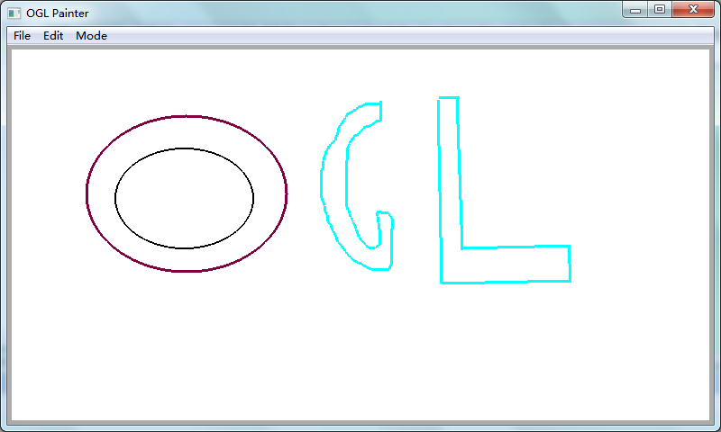

wxOGL
===
这个是简单的用wxWiget+wxFormBuilder+OpengL做的一个小的画图程序。练习使用wxWidget

主要的功能如下：
1. 手动画图，画直线， 画圆
2. 可以改变线的颜色和线的宽度
3. 支持撤销和重做
4. 保持图片为tga文件和bmp文件
5. 较方便地扩展自己的图元类型

项目是用VS2005编译的。

第三发库
用的是wxwidget2.9的版本。
下载地址http://www.wxwidgets.org/

编译的时候，记得打开支持Opengl的选项
在wxWidgets工程目录下的include/wx/msw/setup.h中将
define wxUSE_GLCANVAS 0改为 1
然后重新编译wx_gl工程文件
再将lib/vc_lib/msw/wx/setup.h中的
define wxUSE_GLCANVAS 0改为 1

